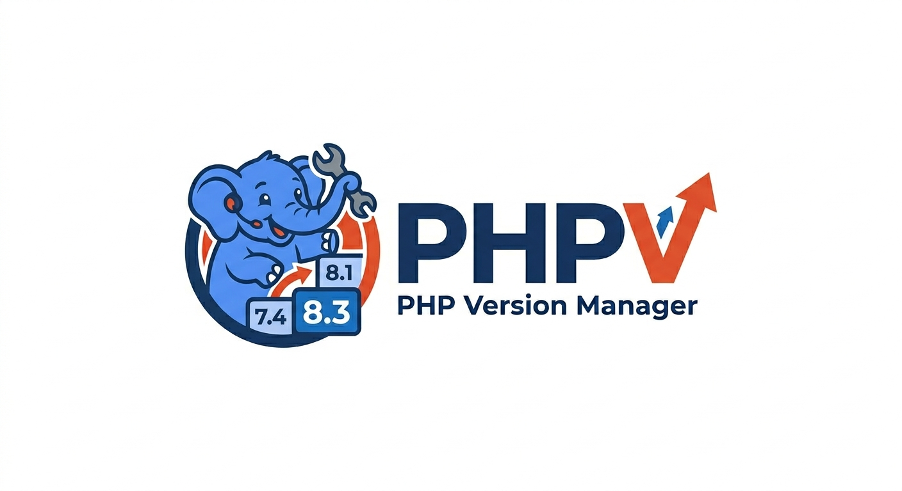

# phpv — The PHP Version Manager That Actually Compiles

[](https://github.com/supanadit/phpv)
[](https://github.com/supanadit/phpv/blob/main/LICENSE)
[](https://github.com/supanadit/phpv/releases)

Yet another PHP multi-version installation and management ?

**PHP has no pre-built Linux binaries. Every other major language does.**

Node.js? `nvm install 20` downloads a binary in seconds. Python? `pyenv install 3.12` compiles, but with minimal deps. Ruby? Same story. PHP? You need a lot of system libraries, each with the right `-dev` package, and one wrong `./configure` flag means your installation silently lacks MySQL support.

**phpv fixes this.** It doesn't just download — it resolves, compiles, and wires together the entire dependency graph so `phpv install 8.4` actually works.

---

## Why phpv?

### The Problem Nobody Else Solved

|                                        | Node.js  | Python    | Ruby      | **PHP**                          |
| -------------------------------------- | -------- | --------- | --------- | -------------------------------- |
| Pre-built Linux binaries               | Yes      | Limited   | No        | **No**                           |
| Must compile from source               | Fallback | Primary   | Primary   | **Always / Pre-built in future** |
| Build deps per extension               | None     | Few       | Few       | **Yes**                          |
| Silently breaks without deps           | No       | Sometimes | Sometimes | **Yes**                          |
| Extension ecosystem (MySQL, PDO, etc.) | N/A      | pip       | gems      | **Bundle + PECL**                |
| Version manager handles deps           | N/A      | No        | No        | **phpv does**                    |

`phpv install 8.4` resolves the full transitive dependency graph — OpenSSL, libxml2, curl, zlib, oniguruma — checks what's already on your system, builds what's missing from source, then compiles PHP with the correct `--with-*` flags for every requested extension.

**No other PHP version manager does this.**

---

## Features

### Core

- **Full dependency resolution** — Transitive dependency graph with version constraints. Missing libraries? Built from source automatically.
- **Bundled PHP extensions** — `--with-pdo-mysql`, `--with-curl`, `--enable-intl`, and more. Each mapped to the correct configure flag, system library, and compatible version range.
- **PECL extension management** — Install, list, and uninstall PECL extensions with full build orchestration (phpize → configure → make → install).
- **System library detection** — Automatically discovers installed dev packages via `pkg-config` and header checks. Uses system libs when available, builds from source when not.
- **Parallel dependency builds** — Dependencies at the same level in the graph are compiled concurrently with goroutine-based parallelism.
- **Zig compiler fallback** — Old PHP versions (< 8.0) that fail with modern GCC? phpv auto-downloads and configures Zig as a drop-in C compiler.

### Version Management

- **Multi-version support** — Install PHP 4.x through 8.x side by side, each with isolated dependencies
- **Smart version resolution** — `phpv install 8` → latest 8.x, `phpv install 8.4` → latest 8.4.x, `phpv install 8.4.5` → exact version
- **Shim-based switching** — Dynamic shim scripts for `php`, `phpize`, `php-config`, `php-cgi` — no PATH conflicts
- **Per-project auto-switching** — Reads `composer.json` and `.phpvrc` for automatic version detection
- **Default version** — Set a global default via `phpv default 8.4`

### Build System

- **Multi-strategy compilation** — 4 build strategies auto-detected per package:
  - `./configure && make && make install` (PHP, OpenSSL, libxml2, curl, oniguruma)
  - `cmake && make && make install` (cmake)
  - `make && make install` (zlib, m4, autoconf, automake, bison, flex, libtool, perl)
  - `./autogen.sh && ./configure && make && make install` (autotools packages)
- **Download with resume** — HTTP downloads support resume, fallback URLs, retry with exponential backoff, and content-type validation
- **SHA256 checksum verification** — Every downloaded archive is verified before extraction
- **State machine tracking** — Installation progress tracked with state transitions (none → in_progress → installed/failed) and automatic rollback on failure
- **Fresh rebuild** — `--fresh` flag for clean rebuilds, `--force` to ignore cached builds

### Developer Experience

- **Single binary** — No runtime dependencies. No Python, no Composer, no shell framework. Just one static Go binary.
- **Shell integration** — Bash, Zsh, and Fish with `eval "$(phpv init bash)"`
- **Shell completions** — Bash, Zsh, Fish, PowerShell
- **Doctor command** — `phpv doctor` checks your system for missing build dependencies
- **Verbose mode** — `--verbose` for full build output, `--quiet` for silent operation
- **JSON output** — `--json` flag for programmatic consumption
- **Dry run** — `--dry-run` to preview what would be built without building

---

## Quick Start

### Install phpv

```bash
curl -fsSL https://raw.githubusercontent.com/supanadit/phpv/main/install.sh | bash
```

Or download a binary from [releases](https://github.com/supanadit/phpv/releases):

```bash
# Linux amd64
curl -fsSL https://github.com/supanadit/phpv/releases/download/v0.1.0/phpv-v0.1.0-linux-amd64 -o phpv
chmod +x phpv && sudo mv phpv /usr/local/bin/
```

### Initialize Your Shell

```bash
# Bash — add to ~/.bashrc
eval "$(phpv init bash)"

# Zsh — add to ~/.zshrc
eval "$(phpv init zsh)"

# Fish — add to ~/.config/fish/config.fish
phpv init fish | source
```

### Install PHP

```bash
phpv install 8.4        # Latest 8.4.x with all dependencies
phpv install 8          # Latest 8.x.x
phpv install 8.4.0      # Exact version

# With extensions
phpv install 8.4 --ext curl,openssl,intl

# With verbose output to watch the build
phpv install 8.4 --verbose

# Using Zig compiler for old PHP
phpv install 5.6 --compiler zig
```

### Switch Versions

```bash
phpv use 8.4            # Activate for current shell
phpv default 8.4        # Set as global default
phpv versions            # List installed versions
phpv which               # Path to current PHP binary
```

### Manage PECL Extensions

```bash
# Download archive on https://pecl.php.net/packages.php
phpv pecl install cld-0.5.0.tgz
phpv pecl list
phpv pecl uninstall cld
```

### Diagnose Issues

```bash
phpv doctor              # Check system dependencies
phpv install 8.4 --fresh --verbose  # Clean rebuild with full output
```

---

## How It Works

```
phpv install 8.4
       │
       ▼
  Resolve "8.4" → "8.4.19" (latest patch)
       │
       ▼
  Build dependency graph:
    PHP 8.4.19
    ├── openssl 3.x
    ├── libxml2 2.x
    ├── curl 8.x
    ├── oniguruma 6.x
    ├── zlib 1.x
    └── build tools (autoconf, bison, re2c, ...)
       │
       ▼
  For each dependency level (in parallel):
    ┌─────────────────────────────────────┐
    │ advisor.Check()                      │
    │   └── System has libxml2-dev? ✓ Use │
    │   └── System has openssl-dev?  ✗ Build│
    └─────────────────────────────────────┘
       │
       ▼
  Build missing deps from source:
    download → verify checksum → extract → compile
       │
       ▼
  Build PHP:
    ./configure --with-openssl=... --with-curl=... --enable-mbstring ...
    make -j$(nproc) && make install
       │
       ▼
  Generate shims → Done.
```

---

## All Commands

| Command                           | Description                                  |
| --------------------------------- | -------------------------------------------- |
| `phpv install <version>`          | Install PHP version with all dependencies    |
| `phpv use <version>`              | Switch to PHP version in current shell       |
| `phpv default <version>`          | Set global default PHP version               |
| `phpv versions`                   | List installed PHP versions                  |
| `phpv list`                       | List available PHP versions from source      |
| `phpv which`                      | Show path to current PHP binary              |
| `phpv uninstall <version>`        | Remove PHP version and isolated dependencies |
| `phpv upgrade [version]`          | Upgrade to latest patch/minor version        |
| `phpv doctor`                     | Check system for missing build dependencies  |
| `phpv pecl install <ext-archive>` | Install PECL extension                       |
| `phpv pecl list`                  | List installed PECL extensions               |
| `phpv pecl uninstall <ext>`       | Uninstall PECL extension                     |
| `phpv build-tools clean`          | Remove unused shared build tools             |
| `phpv init <shell>`               | Output shell initialization code             |
| `phpv completion <shell>`         | Generate shell completions                   |

### Install Flags

| Flag                | Description                         |
| ------------------- | ----------------------------------- |
| `--verbose`         | Show full build output              |
| `--quiet`           | Suppress all non-error output       |
| `--force`           | Rebuild even if already installed   |
| `--fresh`           | Remove existing installation first  |
| `--compiler <name>` | Use specific compiler (e.g., `zig`) |
| `--ext <name>`      | Enable PHP extension (repeatable)   |
| `--dry-run`         | Preview without building            |
| `--json`            | Output in JSON format               |

---

## Comparison

### vs phpbrew

|                           | phpv                          | phpbrew                              |
| ------------------------- | ----------------------------- | ------------------------------------ |
| Language                  | Go (single binary)            | PHP (requires Composer)              |
| Dependency resolution     | Automatic transitive graph    | Manual — you install `-dev` packages |
| System library detection  | Auto via pkg-config + headers | None                                 |
| Parallel builds           | Yes (goroutines)              | No (sequential)                      |
| Build failure rollback    | Yes (state machine)           | No (leaves broken state)             |
| PECL management           | Built-in                      | Plugin                               |
| Zig compiler fallback     | Yes                           | No                                   |
| Configure flag resolution | Automatic per extension       | Manual (`+mysql`, `+pdo`)            |
| Download resume           | Yes                           | No                                   |
| Checksum verification     | Yes                           | No                                   |
| Old PHP on modern systems | Yes (Zig fallback)            | Often fails                          |

### vs NVM / pyenv / rbenv

|                       | phpv                      | nvm             | pyenv               | rbenv               |
| --------------------- | ------------------------- | --------------- | ------------------- | ------------------- |
| Install method        | Compile from source       | Binary download | Compile from source | Compile from source |
| Dependency management | **Full automatic**        | N/A (binaries)  | **None** (manual)   | **None** (manual)   |
| Extension management  | **Bundled + PECL**        | N/A             | N/A                 | N/A                 |
| When deps missing     | Builds from source        | N/A             | **Build fails**     | **Build fails**     |
| Parallel compilation  | Yes                       | N/A             | No                  | No                  |
| Install reliability   | High (advisor + fallback) | High (binaries) | Low-Medium          | Low-Medium          |

PHP is fundamentally harder to manage than Node/Python/Ruby — it has no pre-built Linux binaries, requires a lot of system libraries, and each extension needs its own configure flag and dependency. phpv is the only version manager that handles all of this automatically.

---

## Architecture

phpv is built with [Clean Architecture](https://blog.cleancoder.com/uncle-bob/2012/08/13/the-clean-architecture.html) principles:

```
┌──────────────────────────────────────────────┐
│  Delivery (app/)                              │
│  Cobra CLI commands, fmt.Print, UI output     │
├──────────────────────────────────────────────┤
│  Usecase (internal/terminal/)                 │
│  Business logic only — Install, Use, PECL     │
├──────────────────────────────────────────────┤
│  Services                                     │
│  assembler/  → dependency graph resolution     │
│  bundler/    → build orchestration             │
│  forge/      → multi-strategy compilation      │
│  advisor/    → system vs build-from-source     │
│  download/   → HTTP with resume + checksum     │
│  unload/     → archive extraction              │
│  pattern/    → URL template registry           │
│  shim/       → shim script generation          │
├──────────────────────────────────────────────┤
│  Domain (domain/)                             │
│  Pure data types — no business logic           │
└──────────────────────────────────────────────┘

Repository implementations:
  internal/repository/disk/   filesystem, build state, forge
  internal/repository/memory/ package definitions, extensions
  internal/repository/http/   download with resume
```

Every service defines a repository interface. Implementations are swappable. All business logic is testable with mocks. No `fmt.Print` in the usecase layer.

---

## PHPV_ROOT Structure

```
$PHPV_ROOT/
├── bin/                    # Shim binaries (php, php-cgi, phpize, etc.)
├── build-tools/            # Shared build tools (autoconf, bison, re2c, etc.)
│   └── {pkg}/{ver}/
├── cache/                  # Downloaded archives (with resume support)
│   └── {pkg}-{ver}.tar.{gz|xz}
├── default                  # Default PHP version file
├── sources/                # Extracted source code
│   └── {pkg}/{ver}/
└── versions/               # Installed PHP versions
    └── {php-version}/
        ├── dependency/      # Isolated dependencies per PHP version
        │   └── {pkg}/{ver}/
        └── output/          # PHP installation prefix
```

Each PHP version gets its own isolated dependency tree — no conflicts between versions.

---

## Environment Variables

| Variable       | Description                  | Default   |
| -------------- | ---------------------------- | --------- |
| `PHPV_ROOT`    | Root directory for phpv data | `~/.phpv` |
| `PHPV_CURRENT` | Override current PHP version | (none)    |

---

## Requirements

### Linux

- `build-essential` or equivalent development tools
- `gcc` or `zig` compiler (phpv can auto-provision zig)
- `make`, `pkg-config`, `xz-utils`

System libraries are auto-detected. phpv will use system packages when available and build from source when not. For faster installs, pre-install dev packages:

```bash
# Debian/Ubuntu
sudo apt-get install build-essential libssl-dev libcurl4-openssl-dev \
    libxml2-dev libonig-dev libzip-dev libsqlite3-dev libicu-dev pkg-config \
    cmake perl m4 autoconf automake libtool re2c bison xz-utils

# Fedora/RHEL
sudo dnf install @development-tools openssl-devel libcurl-devel \
    libxml2-devel oniguruma-devel libzip-devel sqlite-devel \
    pkg-config cmake perl m4 autoconf automake libtool re2c bison xz

# macOS
brew install autoconf automake libtool m4 pkg-config re2c bison xz
```

### macOS

- Xcode Command Line Tools
- Homebrew packages may be required for some dependencies

---

## Installation

### Quick Install (Recommended)

```bash
curl -fsSL https://raw.githubusercontent.com/supanadit/phpv/main/install.sh | bash
```

### Install Specific Version

```bash
INSTALL_VERSION=0.1.0 curl -fsSL https://raw.githubusercontent.com/supanadit/phpv/main/install.sh | bash
```

### From Binary Release

Download from the [releases page](https://github.com/supanadit/phpv/releases):

```bash
# Linux amd64
curl -fsSL https://github.com/supanadit/phpv/releases/download/v0.1.0/phpv-v0.1.0-linux-amd64 -o phpv
chmod +x phpv && sudo mv phpv /usr/local/bin/

# Linux arm64
curl -fsSL https://github.com/supanadit/phpv/releases/download/v0.1.0/phpv-v0.1.0-linux-arm64 -o phpv
chmod +x phpv && sudo mv phpv /usr/local/bin/

# macOS (Apple Silicon)
curl -fsSL https://github.com/supanadit/phpv/releases/download/v0.1.0/phpv-v0.1.0-darwin-arm64 -o phpv
chmod +x phpv && sudo mv phpv /usr/local/bin/
```

### From Source

```bash
git clone https://github.com/supanadit/phpv.git
cd phpv
go build -o phpv ./app/phpv.go
sudo mv phpv /usr/local/bin/
```

---

## Shell Completions

### Bash

```bash
source <(phpv completion bash)
# Or install system-wide:
sudo phpv completion bash > /etc/bash_completion.d/phpv
```

### Zsh

```bash
autoload -U compinit && compinit
phpv completion zsh > "${fpath[1]}/_phpv"
```

### Fish

```bash
phpv completion fish > ~/.config/fish/completions/phpv.fish
```

### PowerShell

```powershell
phpv completion powershell >> $PROFILE
```

---

## Troubleshooting

### Build fails?

```bash
phpv doctor                       # Check for missing system deps
phpv install 8.4 --fresh --verbose  # Clean rebuild with full output
```

### Old PHP compilation fails on modern GCC?

```bash
phpv install 5.6 --compiler zig   # Use Zig as drop-in C compiler
```

### Missing system packages?

phpv automatically detects and uses system libraries. To prefer system packages over building from source, install the `-dev` packages:

```bash
# The advisor service checks for these automatically:
# - pkg-config --exists <lib>
# - Header files in /usr/include/
# - Executables via `which`
```

---

## Development

```bash
# Run all tests
go test ./...

# Run with coverage
go test ./... -coverprofile=coverage.out
go tool cover -html=coverage.out

# Build
go build -o phpv ./app/phpv.go

# Format and vet
go fmt ./... && go vet ./...
```

## Contributing

Contributions are welcome! Please see [CONTRIBUTING.md](CONTRIBUTING.md) for guidelines.

## License

phpv is licensed under the MIT License. See [LICENSE](LICENSE) for details.
