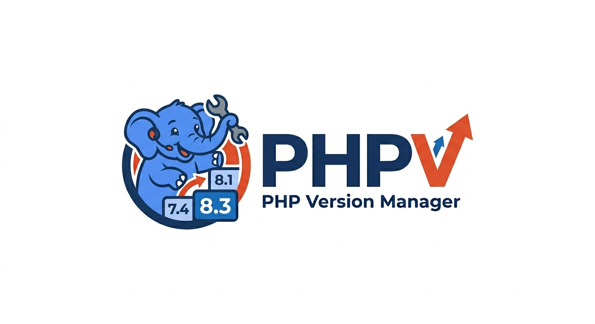

# phpv — The PHP Version Manager That Actually Compiles

[](https://github.com/supanadit/phpv)
[](https://github.com/supanadit/phpv/blob/main/LICENSE)
[](https://github.com/supanadit/phpv/releases)

PHP has no pre-built Linux binaries. Every other major language does. phpv resolves the full transitive dependency graph — OpenSSL, libxml2, curl, zlib, oniguruma, ICU — checks what's already on your system, builds what's missing from source, then compiles PHP with the correct `--with-*` flags. `phpv install 8.4` actually works.

---

## Install

```bash
curl -fsSL https://raw.githubusercontent.com/supanadit/phpv/main/install.sh | bash
```

Or download a binary from [releases](https://github.com/supanadit/phpv/releases):

```bash
curl -fsSL https://github.com/supanadit/phpv/releases/latest/download/phpv-linux-amd64 -o phpv
chmod +x phpv && sudo mv phpv /usr/local/bin/
```

From source:

```bash
git clone https://github.com/supanadit/phpv.git
cd phpv && go build -o phpv ./app/phpv.go
```

---

## Uninstall

```bash
curl -fsSL https://raw.githubusercontent.com/supanadit/phpv/main/uninstall.sh | bash
```

To skip the confirmation prompt:

```bash
curl -fsSL https://raw.githubusercontent.com/supanadit/phpv/main/uninstall.sh | bash -s -- --yes
```

This removes the `$PHPV_ROOT` directory (default `~/.phpv`) and removes the `phpv init` line from your shell config files (`.bashrc`, `.zshrc`, `config.fish`, etc.).

---

## Quick Start

```bash
# Initialize your shell (add to ~/.bashrc, ~/.zshrc, or fish config)
eval "$(phpv init bash)"

# Install PHP — sensible defaults, deps auto-resolved, built from source if needed
phpv install 8.4                              # 25 default extensions, works out of the box
phpv install 7.4                              # Same defaults, auto-bundles OpenSSL 1.1.1w

# Customize
phpv install 8.4 --ext openssl,curl,apcu     # Build exactly this list (no defaults)
phpv install 8.4 --minimal                    # Bare build (--disable-all --enable-cli only)
phpv install 8.4 --jobs 4                     # Parallel make with 4 jobs
phpv install 8.4 --fresh                      # Clean rebuild (delete prefix, keep cached source)
phpv install 8.4 --verbose                    # See full build output

# Switch versions (per-shell, ephemeral — requires `phpv init`)
phpv use 8.3                                  # Current shell only, never touches the global default
phpv use system                               # Per-shell: stop pinning a version (falls back to default/system)
phpv use 8.3 --global                         # Global default
phpv use system --global                      # Use system PHP as the global default
phpv default 8.3                              # Set global default
phpv versions                                 # List installed
phpv which                                    # Path to current PHP

# Per-project version via .php-version
echo "7.2" > .php-version                     # Auto-switch on cd

# List available extensions for any PHP version
phpv extension list

# Manage PHAR tools (per-version — each PHP version has its own phars)
phpv phar install composer                    # Install into the active PHP version
phpv phar install composer --version 8.4      # Install into a specific PHP version
phpv phar install pie                         # Install PIE
phpv phar install wp-cli                      # Install WP-CLI
phpv phar update composer                     # Update to latest
phpv phar list                                # List for active PHP version
phpv phar which composer                      # Show phar path

# PECL extensions
phpv pecl install /path/to/ext-1.0.0.tgz
phpv pecl list
phpv pecl uninstall ext

# Diagnose issues
phpv doctor                                   # System readiness check
phpv doctor 8.4                               # Extension analysis for PHP 8.4
phpv install 8.4 --fresh --verbose

# Export and import PHP builds
phpv share 8.4                                # Export as portable tar.gz bundle
phpv install 8.4 --from bundle.tar.gz         # Install from bundle


# Uninstall
phpv uninstall 8.3

# Shell completion
phpv completion bash                          # Generate shell completion
```

---

Each PHP version gets its own isolated install prefix and phar directory — no conflicts between versions. Dependency versions are resolved per-extension per-PHP-version from the extension graph, so PHP 8.2+ now get the same deterministic dep resolution as 7.x/8.0/8.1. Dependencies are keyed by `(name, version)` and shared across PHP versions that pin the same version — build once, reuse everywhere.

phpv only downloads and extracts what it will actually compile. System packages that satisfy the required version constraints are used directly (no source download), build tools come from the system, and the download phase shows per-package progress. System dev-libraries for extensions are checked automatically and recommended before building — e.g. `phpv extension add pdo_pgsql` prompts to install `postgresql-libs` (Arch), `libpq-dev` (Debian/Alpine), or `postgresql-devel` (Fedora).

---

## Commands Reference

| Command | Description |
| --------- | ------------- |
| `phpv install <ver>` | Install a PHP version with default extensions |
| `phpv rebuild <ver>` | Rebuild PHP with different extensions (keeps deps) |
| `phpv uninstall <ver>` | Remove an installed PHP version |
| `phpv use <ver>` | Switch PHP version for current shell (ephemeral; `--global` for global) |
| `phpv default <ver>` | Set global default PHP version |
| `phpv versions` | List installed PHP versions |
| `phpv which` | Show path to current PHP binary |
| `phpv init <shell>` | Generate shell integration (bash/zsh/fish/pwsh/ksh) |
| `phpv rehash` | Regenerate all shims |
| `phpv doctor [ver]` | System readiness check + extension analysis |
| `phpv update` | Self-update phpv |
| `phpv config` | View and manage configuration |
| `phpv completion <shell>` | Generate shell completion |
| `phpv share <ver>` | Export PHP as portable bundle |
| `phpv extension list [ver]` | List installed extensions |
| `phpv extension available [ver]` | List extensions available for a PHP version |
| `phpv extension add <name>...` | Install extensions into the active version (`--version` to target one) |
| `phpv extension remove <name>...` | Remove extensions from the active version (`--version` to target one) |
| `phpv extension pecl [ver]` | List installed PECL extensions for a PHP version |
| `phpv phar install <name> [ver]` | Install a PHAR tool (composer/pie/wp-cli/phpunit) |
| `phpv phar list [ver]` | List installed PHAR tools |
| `phpv phar update <name> [ver]` | Update a PHAR tool |
| `phpv phar which <name>` | Show path to a PHAR tool |
| `phpv pecl install <name|archive> [ver]` | Install a PECL extension |
| `phpv pecl list [ver]` | List installed PECL extensions |
| `phpv pecl uninstall <name> [ver]` | Remove a PECL extension |
| `phpv apache install <ver>` | Build and install Apache httpd from source |
| `phpv apache uninstall` | Remove Apache httpd |
| `phpv apache configure --php <ver> [--connector fpm\|cgi\|mod_php]` | Configure PHP integration |
| `phpv apache vhost add <docroot> <domain>` | Add a virtual host |
| `phpv apache vhost list` | List virtual hosts |
| `phpv apache vhost remove <domain>` | Remove a virtual host |
| `phpv apache vhost enable\|disable <domain>` | Enable/disable a virtual host |
| `phpv apache start\|stop\|restart\|status` | Manage the Apache (and PHP-FPM) process |

### Install Flags

| Flag | Description |
| ------ | ------------- |
| `--ext <list>` | Comma-separated extension list (replaces defaults) |
| `--minimal` | Bare build (--disable-all --enable-cli only) |
| `--fpm` | Build with `--enable-fpm` (FastCGI Process Manager for webservers) |
| `--cgi` | Build with `--enable-cgi` (for mod_fcgid) |
| `--mod-php` | Build with `--with-apxs2` (Apache module, requires Apache installed) |
| `--fresh` | Delete prefix, keep cached source |
| `--clean` | Delete prefix + source + state |
| `--force` | Force reinstall even if already installed |
| `--static` | Fully static build |
| `--jobs <n>` | Parallel make jobs |
| `--verbose` | Show full build output |
| `--auto-deps` | Auto-install system dependencies |
| `--no-system` | Build all deps from source, skip system packages |
| `--dry-run` | Show what would be done without doing it |
| `--from <bundle>` | Install from a bundle file |

---

## Supported PHP Versions

| PHP | Default extensions | Notes |
| ----- | -------------------- | ------- |
| 8.x | 25 | Full default set |
| 7.0+ | 25 | Full default set |
| 5.6 | 24 | `opcache` skipped (requires PHP 7.0+) |
| 5.2–5.5 | 23 | `opcache` + `json` skipped |
| 5.0–5.1 | 23 | Same as 5.2 ( Experimental ) |
| 4.x | 0 | Use `--ext` to pick extensions ( Experimental ) |

Default extensions: `bcmath`, `curl`, `dom`, `fileinfo`, `filter`, `gd`, `iconv`, `intl`, `json`, `mbstring`, `openssl`, `opcache`, `pdo`, `pdo_mysql`, `pdo_sqlite`, `phar`, `session`, `simplexml`, `sqlite3`, `tokenizer`, `xml`, `xmlreader`, `xmlwriter`, `zip`, `zlib`

Use `--minimal` for a bare build (`--disable-all --enable-cli` only), or `--ext` to specify your own list.

---

## Apache Webserver

phpv can install and manage a fully user-space [Apache HTTP Server](https://httpd.apache.org/) — built from source (plus APR, APR-util, PCRE2, expat) under the phpv root, with no system directories touched and no root required.

```bash
# Build and install Apache httpd (with APR/APR-util/PCRE2/expat)
phpv apache install 2.4.66

# Configure PHP integration (FPM is the default connector)
phpv apache configure --php 8.4 --connector fpm --mpm event

# Or build PHP with FPM support at install time
phpv install 8.4 --fpm

# Serve the current directory at a virtual host
phpv apache vhost add . test.local

# Manage the process (Apache + PHP-FPM)
phpv apache start          # background daemon (use --foreground to block)
phpv apache status
phpv apache restart
phpv apache stop
```

### Connector modes

| Mode | PHP build flag | Notes |
|------|---------------|-------|
| `fpm` (default) | `--enable-fpm` | proxy to a php-fpm pool via `mod_proxy_fcgi`; works with event/worker MPMs and supports per-vhost PHP versions |
| `cgi` | `--enable-cgi` | spawn `php-cgi` via `mod_fcgid` |
| `mod_php` | `--with-apxs2` | load PHP compiled as an Apache module; requires prefork MPM, single PHP for all vhosts |

### Virtual host flags

```
phpv apache vhost add /srv/app app.local --ssl --alias www.app.local
phpv apache vhost add . test.local --php-version 8.4   # per-vhost PHP (FPM only)
```

Vhosts are stored under `~/.phpv/apache/vhosts/` and auto-included by Apache's config, so adding/removing them never needs sudo. By default Apache listens on port `8080` (no root required); configure a different port with `phpv apache configure --port 80`.

---

## Contributing

See [CONTRIBUTING.md](CONTRIBUTING.md) for setup, architecture, and commit conventions.

## License

[MIT](LICENSE) — Copyright (c) 2025 Supan Adit Pratama
